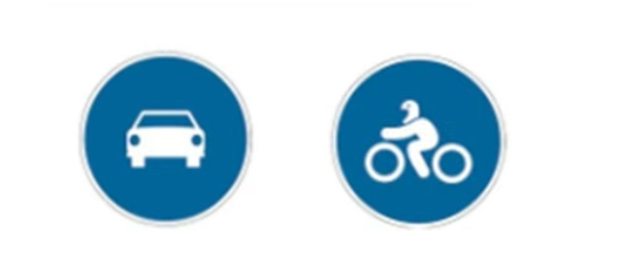
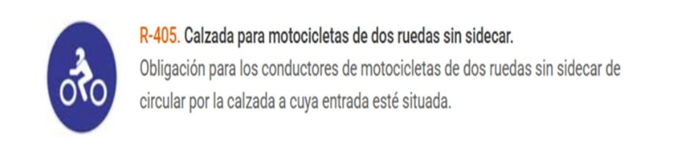

Vehiculos con A2 : Am (mobilitat reduida) ciclomotores, cuadriciclos ligeros y vehiculos mabilidad reducida

A1: 125 cc , 11kW relacion potencia peso 0,1 (amb 3 ruedas 15kW) y con sidecar que compleixi relacion
A2: El del A1 + 35kW, relacion 0,2. NO poden ser derivades d'alguna amb mes del doble de la potencia (no es pot limitar una 1000 o 71 kW )

Son menos estables, mucha aceleracion poco peso
cuando van en grupo, la menos potente delante

carenado mejora estabilidad, aerodinamica, ahorra combustible, menor fatiga y mayor protecion a cocupantes

## Equipamiento obligatorio

Homologado
Mejor integral
talla bien ajustada
Color Llamativo
Si recibe golpe cambiarlo

No caso son 4 punts i 200 euros

Obligacion de que el pasajero lleve casco es el conductor

hay escepcion medica para casco

Guants obligatoris?? que mes es obligatori??

## Mandos Motos

### dreta

freno delantero en manillar, freno trasera estribera

puno acelerador

### esquerra

Embreague i canvi de marxes

## Posicion

Posicion suelta comoda para actuar sin forzar

Brazos ligeramente dlexionados sin soportar el peso

Piernas cenidas moto

Amb companero las frenads son mas largas, centro equilibrio va atras, riesgo bloqueo trasera menos peligro (menys probable)

Acelera menos y aumenta pression neumatico trasero, hay movimiento de madsa de delante atras

Hay mas deriva con companeri (es deforma mes)

## Frenar

70 delantero 30 trasero
empezar trasero terminar delantero

## Fuerzar

Centrifuca nos expulsa

centripeta la accion del conductor sobre los mandos

subvirage la centrifuga muy fuerte

## ITV

La fecha cuenta desde 1ra matriculacion

hasta 4 anos da igual, dsps cadda 2 semrpe

Noivel 1r ano novel,
si teniem ja B no cal carnet novel, amb A2 igul

## Senyaes especifica motocicleta

Esquerra afecta, dreta no

esquerra no obliga a la moto, pero pot entrar

> [!tip] Tnir en compte
> 

> [!Danger] Llums i la Moto!!
> La moto sempre amb luz de cruze encesa sempre

> [!info] Llum marxa enrere?
> Les motos no n'han de portar, no estan obligades

