# Curso teórico de carnet B

> [!info] Fuentes
> Apuntes propios del curso teórico en vídeo: https://www.youtube.com/watch?v=Sx2prUxQbaM
> Repaso pre-examen: https://youtu.be/bB8RRwmJyWM?si=7k8rRBmgK3cJibde
>
> Verificado contra **RGC (BOE-A-2003-23514)** y **DGT (revista.dgt.es)**.

---

## Personas y vehículos

### Conductor

- Persona que **conduce** cualquier vehículo
- Incluye quien conduce **animales** (montura o tracción)

### Peatón

- Persona **a pie**
- También: desmontado de bici/ciclomotor o en silla de ruedas (incluso motorizada)

### Vía pública

- Circulan: **peatones, animales y vehículos** (de tracción o motor)
- Máxima: no molestar, no sorprender, **advertir** y dejarse comprender

### Vehículo (art. 4 RGC)

- Aparato apto para circular por vía pública o privada de uso común
- Tipos:
  - **A motor** (se mueve por sí solo): automóvil, motocicleta, ciclomotor (legalmente), etc.
  - **Sin motor**: ciclo, animal de montura, vehículo a tracción animal

### Tipos de vehículo a motor

- **Automóvil**: turismo, derivado de turismo, mixto, motocicleta (con/sin sidecar)
- **Camión**: zona de personas y mercancía **separadas físicamente** (≠ furgoneta)
- **Furgoneta**: todo en el **mismo chasis**
- **Vehículo especial**: agrícola (tractor, cosechadora) o de obras y servicios
  - Por su tamaño, peso o necesidad de permiso específico

> [!warning] Ciclomotor = NO motor (legalmente)
>
> - Velocidad máx. **45 km/h**
> - Placa amarilla obligatoria
> - Incluye: triciclos/quadriciclos ligeros, tranvías, VMP (patinetes) y vehículos para personas con movilidad reducida

### Masas y pesos

- **Tara / masa en vacío**: vehículo sin nada (ni conductor ni equipaje)
- **En orden de marcha**: con conductor
- **MMA (masa máxima autorizada)**: **nunca** se puede superar
  - Si MMA = 600 kg y vas con 5 personas + equipaje a tope (601 kg) → **fuera de norma**
- **Masa por eje**: peso que soporta cada eje (eje = lo que une las ruedas)

---

## La vía

### Partes

- **Plataforma**: lo asfaltado
- **Calzada**: parte por donde circulan los vehículos
- **Mediana**: lo que divide dos calzadas opuestas
- **Arcén**: franja lateral, no apta normalmente para circular

### Tipos de vía

- **Travesía**: vía urbana que es **parte de una interurbana** → se considera **urbana**
- **Autopista** vs **Autovía**:
  - Ambas: **mín. 60 km/h** y ≥2 carriles por sentido
  - **Autopista**: accesos controlados + vallada (sin acceso a propiedades ni animales)
  - **Autovía**: accesos limitados

> [!danger] Prohibidos en autopista/autovía
>
> - Vehículos que **no alcancen 60 km/h**
> - **Ciclistas**: en autopista nunca; en autovía solo **mayores de 14** y sin prohibición expresa

### Arcén — quién DEBE circular por él (art. 36 RGC)

- **Peatones** (con chaleco reflectante; grupos, además, con luces)
- **Ciclos y ciclomotores**
- **Animales de montura** y de tracción animal
- **Vehículos especiales** que no alcancen **60 km/h**
- **Vehículos de emergencia** en servicio

> [!example] Peatón solo = arcén IZQUIERDO
>
> - Único caso: peatón aislado va por la **izquierda**
> - Si vas **desmontado de bici** o en **silla de ruedas** → arcén **derecho**

---

## Carriles

### Circulación normal

- **Dentro de poblado**: carril que mejor convenga al destino
- **Fuera de poblado**: **siempre derecha** (si hay varios sin delimitar)
- **Delimitados**: el que indique la señalización

### Vía con 3 o más carriles por sentido

- Sirven para **adelantar**
- **Camiones** (+3500 kg MMA o >7 m) y conjuntos de vehículos:
  - Solo pueden ir por el **2.º carril**
  - **NUNCA** por el 3.er carril
  - **Justo 3500 kg** → sí puede

> [!info] Tractocamión
> Camión al que se engancha un contenedor/remolque → tractor + semirremolque

### Carril habilitado en sentido contrario

- **Por fluidez** (señalización blanca/azul):
  - Solo **turismos sin remolque** y **motocicletas**
  - Velocidad: **máx 80 / mín 60 km/h**
- **Por obras** (señalización amarilla):
  - **Todos** los vehículos autorizados en la vía
  - Velocidad: **máx 80 / mín 60 km/h** + luces de cruce

### Carril reversible

- Delimitado por **doble línea discontinua**
- Sentido lo indican señales luminosas con **flechas** o **cruces**
- Velocidad: la de la vía + **luces encendidas**

### Carril VAO (Vehículos Alta Ocupación) — art. 35 RGC

- Reduce congestión y mejora fluidez
- **Autorizados**:
  - Turismos, mixtos adaptables (incluso **solos**, sin acompañante)
  - Motocicletas (también **solas**)
  - **Autobuses** (+3500 kg)
  - Vehículos de emergencia, taxis
- **Prohibidos**:
  - Peatones, ciclos, ciclomotores
  - Camiones, furgonetas
  - **Turismos con remolque**

### Carril trenzado

- Sirve **tanto para entrar como para salir**

---- Minut 38

## Cómo circular

### Distancia de seguridad

| Situación                             | Distancia                       | Equivalencia                            |
| ------------------------------------- | ------------------------------- | --------------------------------------- |
| **Dentro de poblado**                 | **2 segundos** (frente)         | Velocidad × 2/3,6 = metros              |
| **Fuera de poblado**                  | **3 segundos** (freno)          | Velocidad × 3/3,6 = metros              |
| **Dentro de un túnel**                | **4 segundos** o **100 m**      | A velocidad alta, dan valores similares |
| **Vehículo de +3.500 kg delante**     | **50 m** mínimo (fuera poblado) | Camiones, autobuses, conjuntos          |
| **Túnel con vehículo pesado delante** | **150 m** o **6 segundos**      | Regla reforzada                         |

> [!tip] Método de las galones
> Cuando ves una **galón** (panel de galones en la calzada) debes **poder ver otra** galón completa en la vía. Si ves la siguiente galón → distancia correcta. Si no la ves → estás demasiado cerca.

### Distancia lateral

- **Motocicletas, ciclomotores y bicicletas:** mínimo **1,5 m**
- Para **adelantarlos**: misma distancia + ocupar **carril completo** si hace falta
- **Obstáculos** en la calzada: misma separación lateral

---

### Velocidad

#### Límites genéricos — fuera de poblado

> [!info] Cómo leer la tabla
>
> - 1.er grupo: **turismos y motos**
> - 2.º grupo: llevan **personas** (autobuses, vehículos mixtos)
> - 3.er grupo: **mercancías o conjuntos** (camiones, turismos con remolque)

> [!tip] Truco de test — "100 menos 10"
> La velocidad de turismos en autovía (100) y la de camiones en autovía (90) se diferencian siempre en **10 km/h**. Misma lógica para autopista (120 vs 90 entre turismos y camiones).

#### Límites mínimos de velocidad

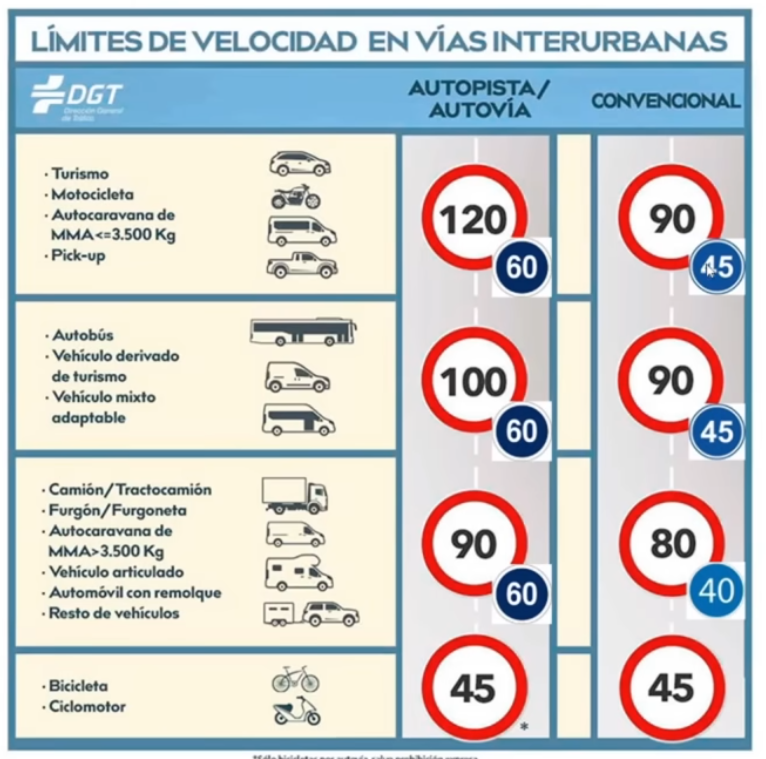

- **Autopista:** mín. **60 km/h**
- **Autovía:** mín. **60 km/h**
- **Convencional:** mín. **no inferior a la mitad** del máximo (regla general)

#### Límites concretos (casos especiales)

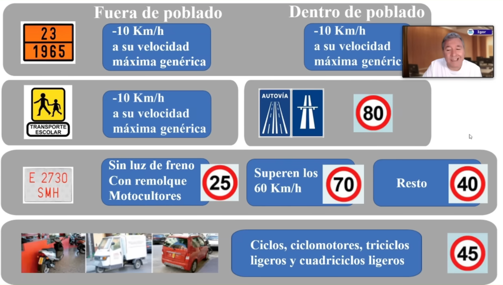

| Caso                                                | Velocidad                                                               |
| --------------------------------------------------- | ----------------------------------------------------------------------- |
| **Mercancías peligrosas**                           | **80 km/h** (autopista/autovía) / **40 km/h** (túneles con restricción) |
| **Transporte escolar** (fuera de poblado)           | **90 km/h**                                                             |
| **Vehículo especial sin luz** (girofaros amarillos) | **70 km/h** máximo en vía interurbana                                   |
| **Autopista/autovía dentro de poblado**             | **80 km/h**                                                             |

> [!warning] Mercancías peligrosas
> Art. 64 RGC: en autopistas y autovías la velocidad máxima de los vehículos que transportan **mercancías peligrosas** es de **80 km/h** (no 90 como los camiones normales).

#### Límites dentro de poblado

| Configuración de la vía                               | Velocidad máxima |
| ----------------------------------------------------- | ---------------- |
| **2 o más carriles por sentido**                      | **50 km/h**      |
| **1 carril por sentido**                              | **30 km/h**      |
| **Plataforma única** (calzada y acera al mismo nivel) | **20 km/h**      |
| **Travesía** (vía urbana con tramo interurbano)       | **50 km/h**      |

> [!info] Reglas para contar carriles
>
> - **Solo cuentan los carriles de tu sentido**, los del otro sentido no influyen
> - **Solo cuentan los carriles por los que puede circular un turismo**: bus, taxi, bici, etc. no cuentan a estos efectos
>
> 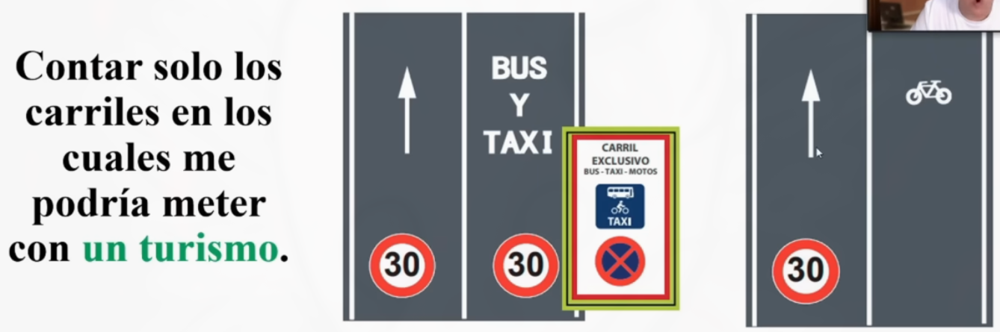

> [!success] Prevalencia de señales
> Aunque la norma general diga 50, 30 o 20, **siempre hay que hacer caso a las señales específicas** que indiquen otra velocidad.

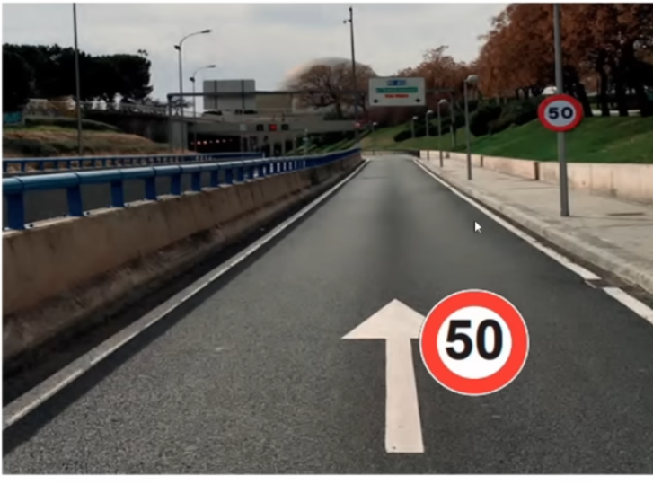

> [!example] Orden de prevalencia
>
> 1. **Señal específica** (limitación concreta en el tramo)
> 2. **Norma general** del RGC según tipo de vía
>
> Nunca al revés: la norma general no puede ampliar lo que la señal prohíbe.

---

## Velocidad adecuada

> Recordatorio operativo (sentido común, no objeto de pregunta de examen): la velocidad debe ser **adecuada a la vía, al tráfico y a la climatología**. Moderar ante ciclistas o peatones, y **siempre** donde tenga que cederse el paso.

---

## Prioridad

### Intersecciones

- **Cruce de vías** = mismo nivel (una glorieta es un cruce de vías regulada).
- **Norma general:** prioridad a la **derecha**.
- **Excepciones a la norma general** (pierde prioridad el de la derecha):
  - **Vía sin pavimentar** sale a pavimentada → prioridad el de la pavimentada.
  - **Vehículo sale de inmueble o parking privado** → prioridad el que ya está en la vía.
  - **Vehículo sobre rieles** (tranvía) → siempre tiene prioridad.

> [!warning] Esta línea NO dice prioridad
> 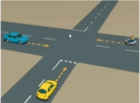
> Esta marca vial amarilla solo significa "si quieres, puedes detenerte". **No establece prioridad** — se aplica la norma general (derecha).

> [!bug] Caso raro de prioridad
> 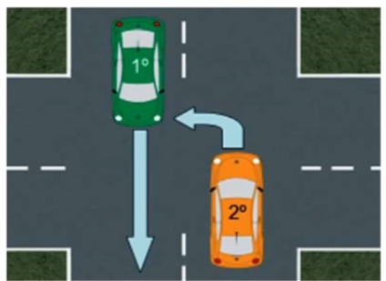
> Aplica norma general y ya: primero pasa **moto, amarillo, azul**.

- **En rotonda partida con semáforo:** paramos en el **eje central** (semáforo en rojo).

### Peatones, ciclistas y animales

- **Peatones:** siempre tienen prioridad, **con o sin paso de peatones**.
- **Ciclistas:** como los peatones, **salvo en intersección** (paso de ciclistas):
  - Solo tienen prioridad si **ya han entrado** al cruce.
  - Debes dejar pasar a **todo el grupo**, no solo al primero.
- **Animales domésticos sueltos (vacas, etc.):** solo tienen prioridad si abajo hay **cañada** señalizada.

> [!tip] Prioridad de vehículos de urgencia
>
> - **Luces azules (intermitentes) + sirena** → prioridad absoluta, no hace falta bocina.
> - **Solo luces azules (sin sirena)** o **luces + bocina** → "pides prioridad", **no es absoluta**.
> - **Para pedir prioridad sin ser vehículo de urgencia:** poner luces de emergencia, agitar pañuelo blanco y claxonar.

---

## Estrechamientos

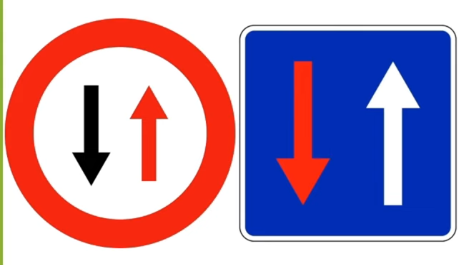

Orden de prioridad al entrar:

1. **El que haya entrado primero** al estrechamiento.
2. **Si no se puede determinar:** el que tenga **menos dificultad** para pasar.
3. **Regla de vehículos largos:** **camión con remolque > coche con remolque > vehículo solo**.

### Prioridad en pendientes

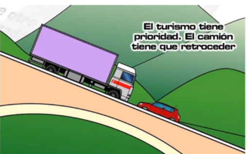

- **En subida:** tiene prioridad el que **sube** (el que baja tiene que ceder, ya que le cuesta más reanudar la marcha).
- **Excepción:** si el que **baja** está mucho más cerca del estrechamiento, pasa primero.

---

## Maniobras

### Pasos previos (siempre)

1. **Observar** el entorno.
2. **Señalizar** la maniobra.
3. **Realizar** la maniobra de forma **progresiva**.

### Retrovisores (obligatorios)

- **Coche:** retrovisor **izquierdo + central** obligatorio. Si no hay central → izquierdo + derecho.
- **Moto** a menos de **100 km/h** → solo **un retrovisor** obligatorio.

> [!tip] Cómo reglarlos
>
> - **Exterior convexo:** los objetos se ven **más pequeños y más alejados** de lo que están (campo visual más amplio, imagen distorsionada). **Confirmar distancia girando la cabeza.**
> - **Central:** imagen más fiel.

### Indicadores de maniobra

- **Indicación óptica:** intermitente o **brazo**.
  - **Frenar:** mover el brazo **arriba y abajo**.
  - **Girar a la derecha / reducir marcha:** palma **hacia atrás** (movimiento de empuje).
  - **Girar a la izquierda / aumentar marcha:** palma **hacia arriba**.
- **Prevalece el brazo sobre el intermitente:** si hay discrepancia, **haz caso al brazo**.

### Claxon

- **Dentro de poblado:** solo si hay **accidente** o peligro inmediato.
- **Fuera de poblado:** también con **propósito de adelantar** (anunciar maniobra).
- **Servicio de urgencia:** uso continuado permitido.

> [!success] Flash de luces como aviso
> El flash de luces **también** es válido para avisar a otros conductores (no solo el claxon).

### Incorporación a la circulación

- **Al principio del carril de aceleración** (no al final): detiene el coche y espera hueco, o acelera para incorporarte.
- **Incorporar un autobús:** no es obligatorio detenerse, pero **si es preciso, hazlo**.

### Adelantamiento

**Cuándo se puede adelantar (espacio + intención):**

- Hay **espacio suficiente** en el carril contrario.
- El vehículo de delante **no ha indicado intención de girar a la izquierda**.
- El vehículo de detrás **no ha iniciado la maniobra** de adelantar.

> [!warning] Vehículo adelantado de gran tamaño
> Si el vehículo adelantado es **muy grande** y no ves si viene tráfico en sentido contrario, debes **indicar con el brazo** que el de delante puede adelantarte cuando sea seguro.

**Excepciones a la norma general (adelantar aunque no haya línea continua):**

- Si el vehículo de delante **va a girar a la izquierda** y te deja espacio.
- **Dentro de poblado** (aunque haya línea continua, en algunos casos).
- Vehículos **sobre rieles** (tranvía).

> [!example] Distancia con usuarios frágiles
> Con **peatones, ciclistas, ciclomotores**: mínimo **1,5 m** lateral. Si es necesario, **invadir el carril completo** para mantener la separación.
> Con **obstáculos** en la calzada: misma separación lateral proporcional a la velocidad.

> [!bug] Distancia al adelantar fuera de poblado
>
> - La distancia lateral es **proporcional a la velocidad**, salvo en túnel (donde se aplican reglas fijas).
> - **Carretera convencional 1 carril por sentido:** dejar **un poco más** de espacio (proporcional + un poco) y solo adelantar si **hay carril para cada sentido** y la visibilidad lo permite.

**Línea continua — cuándo se puede rebasar:**

- **Obstáculos** en la calzada.
- **Adelantar** a vehículo **muy lento** (ciclista si llevas velocidad para rebasarlo con seguridad, animales, ciclomotores, etc.).

**Nunca adelantar:**

- A quien **está adelantando** ya.

> [!success] Adelantar sin invadir sentido contrario
> Si **no invado el sentido contrario** y hay sitio, **sí se puede** adelantar aunque haya línea continua (p.ej. en **autopista**, donde cada sentido tiene su calzada separada).

> [!danger] Paso de peatones
> En paso de peatones o sus **inmediaciones** no se puede adelantar, **salvo** que se haga a **velocidad muy reducida** (casi a paso de peatón) y sin poner en riesgo a nadie.

### Cambio de dirección (giro a derecha o izquierda)

1. **Antes de girar, mirar.**
2. **Colocación en la calzada:**
   - **Vía de sentido único:** colocarse **lo más a la izquierda posible** del carril.
   - **Vía de doble sentido desde mi carril:** puedo **quedararme en el centro** de la vía.
3. **Los giros se hacen "en L"** (de golpe, sin curvas suaves).

> [!warning] Vehículos voluminosos
> Los **vehículos voluminosos** pueden **invadir el carril contrario** para girar (necesitan más radio). Si **no se puede adelantar** o el giro invade zona prohibida, **no se puede girar**. Mismo criterio con **señalización de obligación** (carril obligatorio).

### Cambio de sentido

- **Se puede** si se hace **de una sola maniobra**.
- **Dentro de poblado:** permitido incluso si requiere "adelantar" al vehículo de delante (con espacio).
- **Si hay gente detrás fuera de poblado:** puedo **apoyarme en el arcén** para hacer la maniobra.
- **Funciona como un adelantamiento:** NUNCA en **autopista ni autovía**.

#### Giro indirecto a la izquierda en glorietas partidas

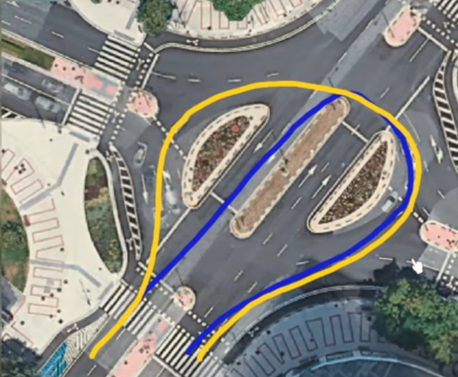
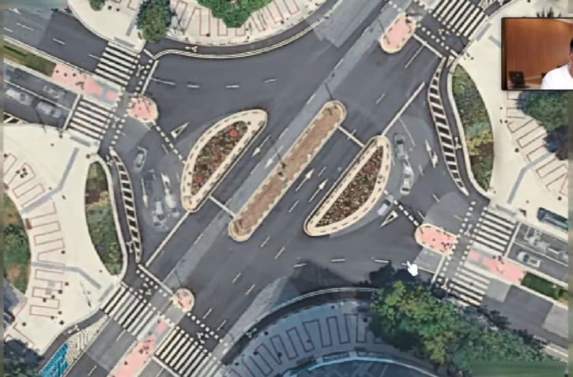

> [!info] Dos opciones válidas
> La opción **azul** es la "mejor" (más directa), pero **ambas son correctas** según el RGC.

---

## Inmovilizaciones

### Conceptos clave

- **Detención:** por razones **ajenas al conductor** (semáforo, atasco, peatón...).
- **Parada:** menos de **2 minutos** sin abandonar el vehículo. Si te alejas (aunque sea un momento) → ya no es parada.
- **Estacionamiento:** inmovilización **superior a 2 minutos** o con abandono del vehículo.

### Prohibiciones de parada y estacionamiento

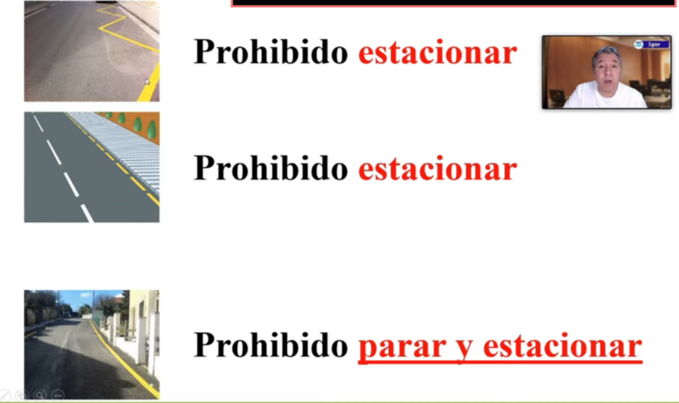

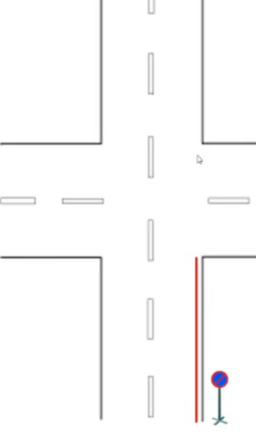

- **Línea amarilla continua:** prohibido **parar y estacionar**.
- **Línea amarilla discontinua:** prohibido **estacionar** (parada sí).
- **Donde no hay línea amarilla:** se puede aparcar (salvo otras prohibiciones).

#### Excepciones y casos especiales

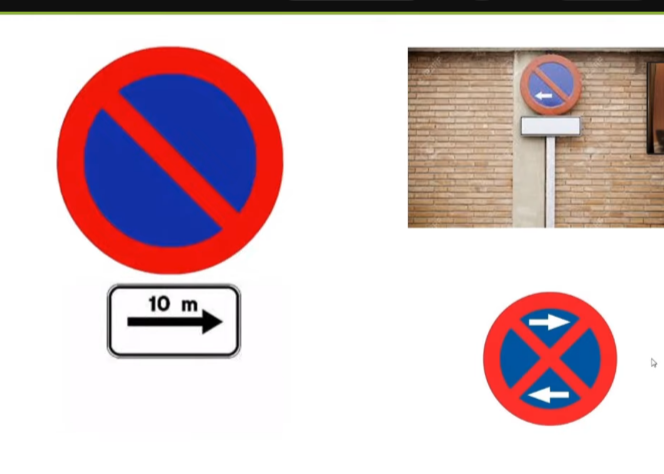
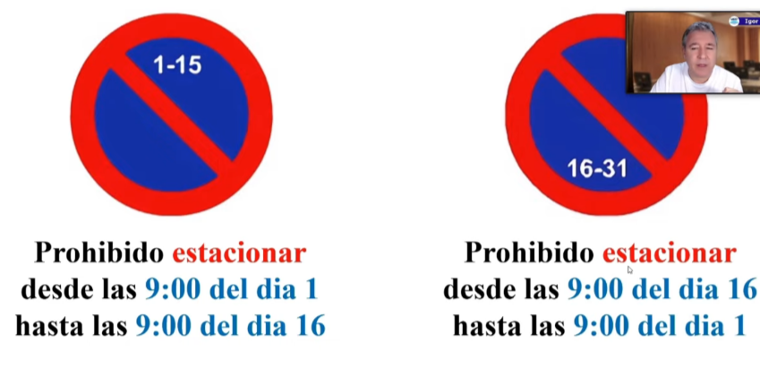

> [!warning] Dónde está muy mal parar
>
> - **Anchura de la calzada inferior a 3 metros.**
> - **En paso de peatones** o sobre la **acera**.
> - **Encima del cebreado** (rayado de isleta).
> - **En parada de bus** (bustaxi).
> - **En plaza de personas con movilidad reducida** (minusválidos).

> [!danger] Arcén en autopista/autovía
>
> - **NO se puede parar ni estacionar** en el arcén de autopista/autovía (salvo emergencia justificada).
> - **Fuera de poblado en carretera convencional:** se puede parar y estacionar **fuera de la calzada y del arcén**, en el lado derecho. Si es **sentido único**, en **cualquier lado**.

### Vehículo detenido en pendiente (inmovilización)

> [!example] Cómo calzar el vehículo en cuesta
>
> | Situación                              | Freno de mano     | Marcha                     | Calzos                      |
> | -------------------------------------- | ----------------- | -------------------------- | --------------------------- |
> | **Cuesta arriba** (miras hacia arriba) | **Freno de mano** | **1.ª marcha**             | Opcional                    |
> | **Cuesta abajo**                       | **Freno de mano** | **Marcha atrás (reversa)** | Opcional                    |
> | **Vehículo pesado**                    | Freno + dirección | Marcha adecuada            | **Sí, calzos obligatorios** |
>
> **Truco para vehículos pesados:** girar la dirección para que la rueda **haga tope contra el bordillo** de la acera (así el bordillo actúa como calzo).

---

## Señalización

### Orden de prioridad entre señales

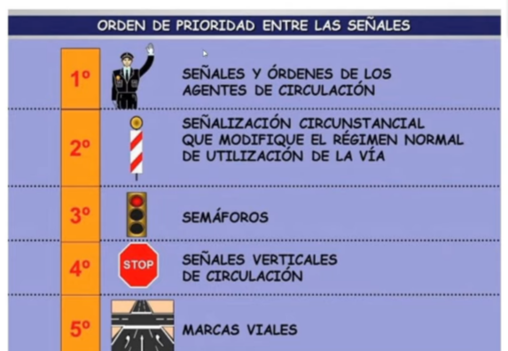

**Orden (de mayor a menor):**

1. **Señales de los agentes de tráfico.**
2. **Señalización circunstancial** (obras, balizas...).
3. **Semáforos.**
4. **Señales verticales** de circulación.
5. **Marcas viales** (líneas en el suelo).
6. **Norma general del RGC** (cuando no hay señal).

> [!bug] Dos señales de la misma prioridad
> Si hay **dos señales de la misma categoría** y parecen contradictorias, **prevalece la más restrictiva** (la que prohíbe más).

> [!info] Señales que afectan a todo el poblado
> 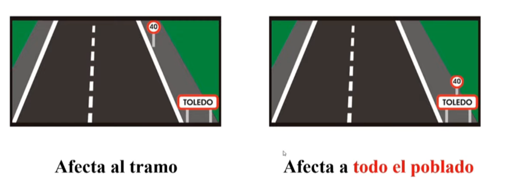
> Cuando la señal dice "**en todo el poblado**" (o similar), afecta a **todas las calles** del término municipal, no solo a la vía donde está.

> [!warning] Semáforo en amarillo intermitente
> 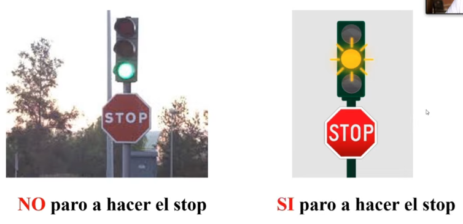
> Un semáforo con **luz amarilla intermitente** equivale a un semáforo **estropeado**: se aplica la **norma general** (prioridad derecha, agentes, etc.).

> [!success] Señales en vías de 3 o más carriles
> 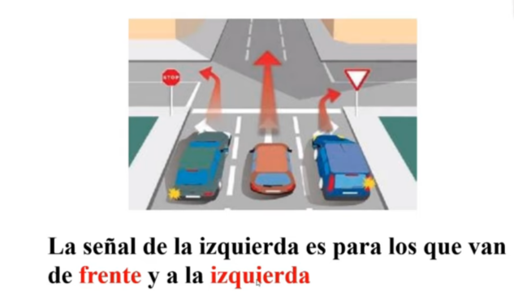
> Las señales en este tipo de intersecciones afectan a **los vehículos que van de frente y a la izquierda** (los otros carriles tienen señales diferentes).

### Señales de los agentes de tráfico

> [!info] Resumen rápido (raro en examen, pero lo básico)

| Señal del agente                              | Significado                                                                 |
| --------------------------------------------- | --------------------------------------------------------------------------- |
| **Brazo vertical (levantado)**                | **Stop** para todos los que se aproximan. Los que ya han cruzado, siguen.   |
| **Brazo horizontal (extendido a un lado)**    | **Stop** solo para los que vienen de ese lado.                              |
| **Brazo en movimiento (indicando dirección)** | "Adelante / circule" para los vehículos a los que señala.                   |
| **Silbato (agente motorista)**                | Un toque corto = "stop"; dos toques cortos = "adelante".                    |
| **Luces de la motocicleta del agente**        | Coinciden con la señal manual (flechas de dirección = vía libre; X = stop). |

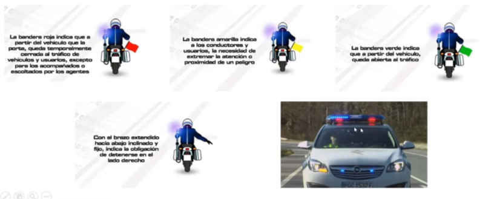

> [!success] Conos = línea continua
> Una **línea de conos** en la calzada equivale, a efectos de prioridad, a una **línea continua**. No se puede rebasar.

### Semáforos

- **Flecha en diagonal** (semáforo para tranvía/bus/taxi): verde a la **izquierda o derecha** (según la flecha).
- **Dos luces intermitentes:**

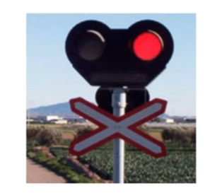

> [!danger] Semáforo rojo intermitente
> Una **luz roja intermitente** equivale a una **señal de STOP** (ceda el paso obligatorio, detenerse). **No pasar** si está intermitente.

> [!success] Aspa (X) roja en semáforo de carril
> En los **semáforos de carril** (carriles reversibles, VAO), una **aspa roja iluminada** prohíbe **ocupar el carril**. Equivale a un "carril cerrado" — debes abandonarlo en cuanto puedas.
> Fuente: DGT, 02/06/2026 (https://www.dgt.es/comunicacion/noticias/20260602-flechas-en-senales-1/).

> [!warning] Intersección con triángulo de peligro
> 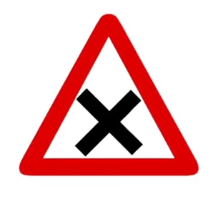
> Intersección **no regulada** (semáforo apagado o con triángulo de peligro): se aplica la **norma general** del RGC (prioridad derecha, agentes, etc.).

---

## Señales de peligro (grupo P)

> [!info] Cómo funcionan
>
> - **Forma:** triángulo con borde rojo y fondo blanco (peligro genérico).
> - **Distancia:** se colocan a **150 m** antes del peligro en vía interurbana; a **50 m** en poblado.
> - **Validez:** desde la señal hasta **fin del peligro** (o hasta una señal de "fin de prohibiciones" o "fin de peligro").

### Paso a nivel

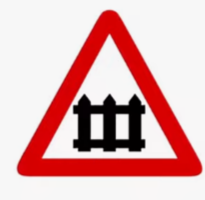

- **Barreras:** paso a nivel con **barreras** o **semibarreras**.
- **Sin barreras (X):** paso a nivel **sin barreras** (mayor peligro).

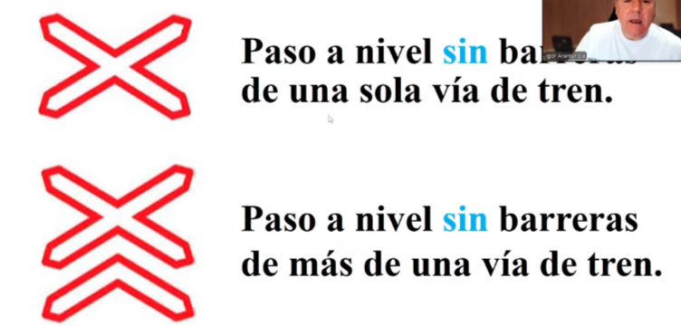

> [!warning] Con o sin barreras, ojo
> La marca vial del paso a nivel en el suelo **siempre** está presente, haya barreras o no. Reduce velocidad y respeta la señalización.

#### Aproximación a paso a nivel

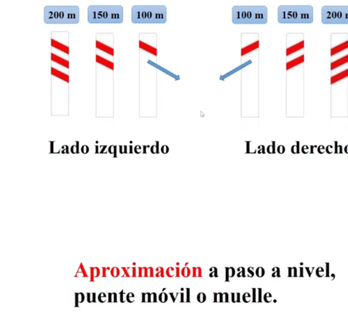

- **Pivotes de 200 m, 150 m y 100 m:** indican la **distancia al paso a nivel** (cuanto más cerca, mayor el peligro). Llevan **franjas rojas y blancas** que indican el **sentido** del peligro (hacia dónde está la vía).

### Perfil irregular y pendientes

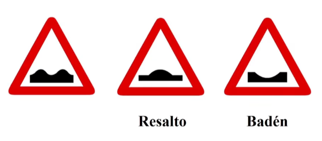

- **Baches / perfil irregular:** pavimento en mal estado.

> [!info] Sentido de las señales de pendiente
> Las señales de **pendiente** se leen de **izquierda a derecha** (empezamos por la izquierda): la señal indica el sentido de la pendiente (subida o bajada pronunciada).

### Animales y obstáculos

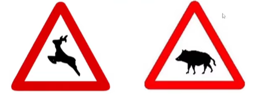

- **Animales en libertad** (jabalíes, ganado): la señal con jabalí es la más habitual.

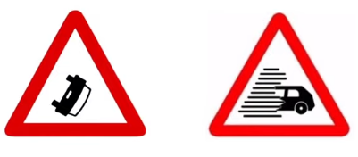

- **Obstáculo en la vía:** hay un obstáculo que reduce el ancho útil.
- **Falta de visibilidad:** tramo sin visibilidad suficiente (no ves lo que hay más adelante).

### Carril trenado y prioridad

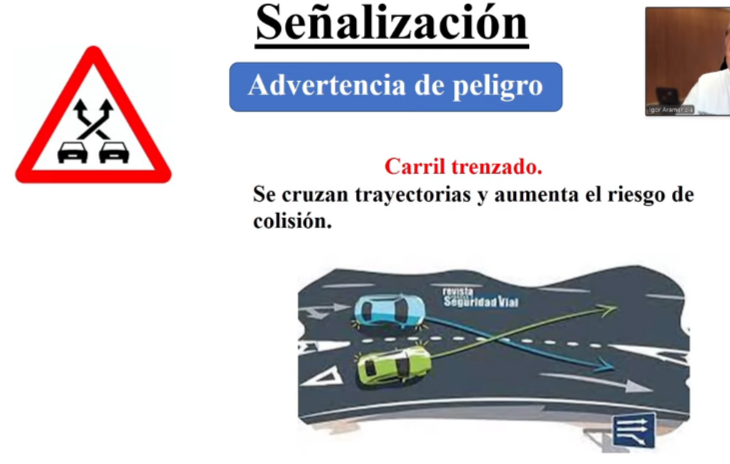

- **Carril trenado:** peligro por la confluencia de vehículos que entran y salen.

> [!tip] Ceda el paso no obliga a frenar
> La señal de **ceda el paso** te **obliga a ceder** el paso, pero **no te obliga a frenar** si la vía está libre y puedes continuar sin detenerse. (El **STOP** sí obliga a detenerse siempre.)

### Señales de prioridad

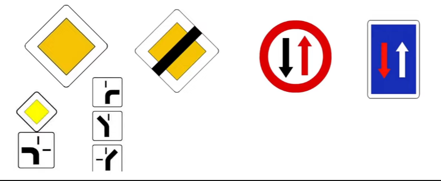

- **Dirección con prioridad:** la señal inferior (rectángulo con flecha vertical) indica que **esa dirección concreta** tiene prioridad sobre la perpendicular.

---

## Señales de prohibición (grupo R)

> [!info] Cómo funcionan
>
> - **Forma:** círculo con **borde rojo** y fondo blanco (prohibición genérica).
> - **Si el círculo tiene una raya diagonal:** la prohibición se aplica a **una parte** de los usuarios (los representados con la raya tachada).

### Circulación prohibida

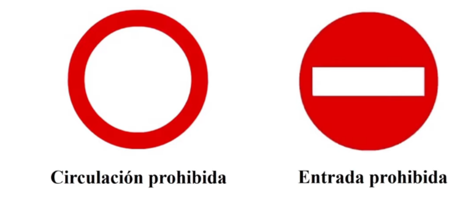

- **Circulación prohibida:** nadie puede circular por esa vía en **ningún sentido**.

### Entradas prohibidas (dirección)

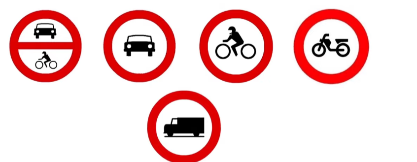

> [!info] Excepciones a las entradas prohibidas
>
> - **Entrada prohibida** (una raya): no se puede entrar en **ese sentido**, pero el **otro sentido** sí puede circular.
> - **Doble sentido prohibido:** vía en **obras** o de **un solo sentido** temporalmente.

### Prohibiciones por masa

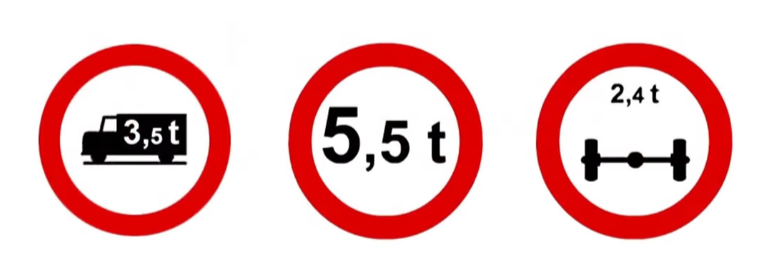

**Tres tipos de prohibiciones por masa:**

| Señal                         | Significado                                                                              |
| ----------------------------- | ---------------------------------------------------------------------------------------- |
| **Solo peso** (cifra con "t") | Prohibido pasar si la **MMA del vehículo** supera la cifra.                              |
| **Camión con peso**           | Prohibido pasar a **camiones** (o vehículos mixtos/adaptables) cuya MMA supere la cifra. |
| **Eje con peso**              | Prohibido pasar si **algún eje** del vehículo supera la cifra.                           |

### Prohibiciones por sustancias peligrosas

> [!tip] Orden de peligrosidad (de mayor a menor)
>
> 1. **Camión con rectángulo amarillo** → sustancias peligrosas en general.
> 2. **Inflamable** (símbolo de llama).
> 3. **Agua / vino / leche** (líquidos que pueden contaminar).
>
> El camión es la prohibición **más restrictiva**; las demás son **específicas** (inflamable, contaminación...).

### Prohibiciones por tamaño

**Señales más habituales:**

- **Camión con longitud debajo:** prohibido a vehículos de **longitud superior** a la indicada.
- **Dos flechas horizontales:** prohibido a vehículos de **anchura superior** a la indicada.
- **Dos flechas verticales:** prohibido a vehículos de **altura superior** a la indicada.
- **Distancia entre ejes:** prohibido a vehículos cuya **distancia entre ejes** supere la cifra.
- **Prohibido pasar sin detenerse:** los vehículos deben **detenerse** antes de continuar (aduana, control, peaje).

### Prohibiciones sobre remolques

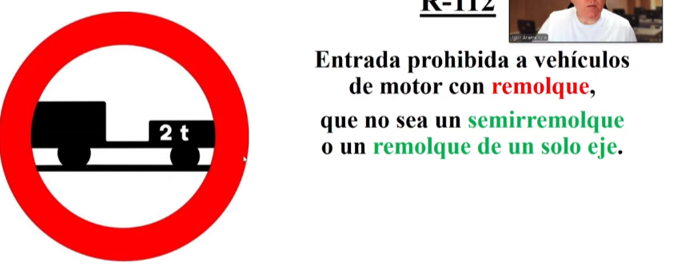

- **Remolques de un solo eje:** una rueda por lado.
- **Semirremolque:** va **apoyado** sobre el camión (no tiene eje delantero propio).
- **Remolque de más de un eje:** va **enganchado** al vehículo tractor (con lanza).

> [!bug] Prohibición de girar izquierda vs cambio de sentido
>
> - Si está **prohibido girar a la izquierda**, **tampoco** se puede hacer **cambio de sentido** (sería girar a la izquierda).
> - Si está **prohibido el cambio de sentido**, **sí** se puede **girar a la izquierda**.

### Fin de prohibiciones

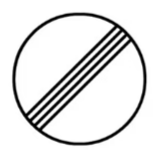

> [!warning] Final de prohibiciones vs final de peligro
> La señal de **fin de prohibiciones** (rectángulo con rayas diagonales) **solo pone fin a prohibiciones**, **no a peligros**.
>
> Si en la señal combinada aparece **peligro arriba + velocidad abajo**, el "fin de prohibiciones" **solo afecta a la velocidad**, **no al peligro** (el peligro puede continuar).

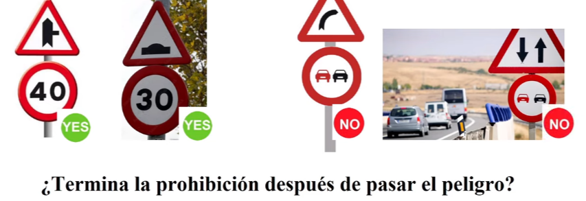

---

## Señales de obligación (grupo R-blue)

> [!info] Cómo funcionan
>
> - **Forma:** círculo con **fondo azul** y símbolo blanco (obligación genérica).
> - **Regla clave:** **no excluyen a nadie** por defecto, **salvo** que la señal lo indique explícitamente.
> - **Excepciones a la obligación general:** las señales de **ciclos, ciclomotores, peatones, velocidad personal y monturas** se **excluyen entre sí** (si una obliga a ciclos, NO obliga a ciclomotores, etc.).

### Obligaciones específicas

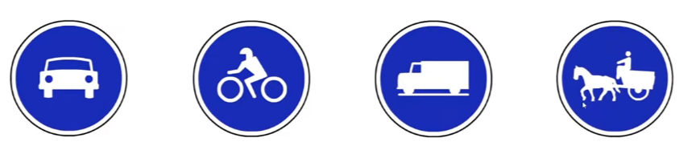

> [!info] Exclusiones de las señales de obligación
>
> - **R-400 (sentido obligatorio — automóviles):** obliga a **automóviles** (turismes, camions, autobusos, furgonetes, motos con sidecar) **excepto las motocicletas de 2 ruedas sin sidecar**.
> - **R-404 (obligación motocicletas):** obliga **solo a motocicletas de 2 ruedas sin sidecar** (las motos con sidecar y los ciclomotores NO están obligados por esta señal, sino por la de automóviles).
> - **Ciclomotores y VMP** (patinetes): tienen sus **propias señales** específicas, no incluidas en las de automóviles ni en las de motos.
>
> **Regla nemotécnica:** cada categoría de vehículo tiene su **propia señal** de obligación. Si no es la tuya, no te obliga — pero sí te obliga la **señal genérica** que te incluya.

> [!bug] ¿Y los tractores?
> La señal de **tractores** obliga a los **tractores y demás vehículos agrícolas** (maquinaria agrícola, cosechadoras, etc.). Los **camiones**, **turismos** y **motos** NO están obligados por esta señal — tienen la suya propia.
>
> **Resumen de exclusiones:** las señales de **ciclos, ciclomotores, VMP, peatones, velocidad personal y monturas** se **excluyen entre sí** (si una obliga a ciclos, NO obliga a ciclomotores ni a VMP). El resto de categorías (automóviles, motos, camiones, tractores) **sí se incluyen** en la señal genérica que les corresponda.

---

## Señales de indicación (grupo S)

### Paso superior de peatones

- **Con escaleras:** paso elevado con acceso por escaleras.
- **Con rampa:** paso elevado con **rampa** especificada en la señal (accesible para sillas de ruedas, carros...).

### Calzada sin salida

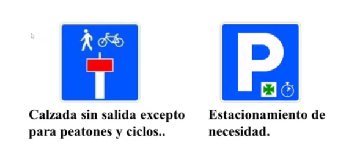

- **Calle sin salida:** es un **cubo rojo**. Indica que la vía termina sin salida (fondo de saco).
  - **Con barra transversal:** la calle **sí tiene salida** (peatonal, no de vehículos).
  - **Sin barra:** la calle **no tiene salida** para nadie.

### Transitabilidad en puerto de montaña (S-21)

> [!info] Estado de la carretera según climatología
> La señal **S-21** indica si el **puerto de montaña** está transitable. El **panel blanco** puede mostrar **tres estados**:
>
> | Estado del panel                          | Significado                                                                                                              |
> | ----------------------------------------- | ------------------------------------------------------------------------------------------------------------------------ |
> | **Verde (ABIERTO)**                       | Puerto transitable para **todos los vehículos** sin restricción.                                                         |
> | **Amarillo (TRANSITABLE CON PRECAUCIÓN)** | Puerto transitable, pero con **restricciones** (p.ej. cadenas obligatorias, prohibido para camiones con MMA > 3.500 kg). |
> | **Rojo (CERRADO)**                        | Puerto **cerrado al tráfico** (nieve, hielo, obras).                                                                     |
>
> **Regla nemotécnica:** la señal indica **a quién se le permite pasar** según el estado (verde = todos, amarillo = algunos con precaución, rojo = nadie).

### Zonas especiales

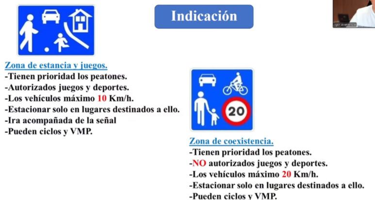

- **Zona de estancia** (aparcamiento, área recreativa).
- **Zona de juegos** (parques infantiles, áreas de recreo).
- **Zona de coexistencia:** vía compartida entre **peatones y vehículos** a velocidad muy reducida.

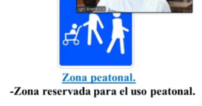

> [!danger] Zona peatonal
> **No pueden entrar vehículos** (salvo los expresamente autorizados: emergencias, servicios, residentes...).

### Vías diferenciadas y confluencia

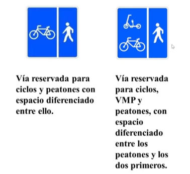

- **Vías diferenciadas:** confirma que las calzadas están **físicamente separadas** (no es la misma calzada compartida).

> [!success] Confluencia de carriles
> Indica la **unión de dos carriles en uno** (un final de carril). **No tiene significado especial** más allá del aviso de la maniobra.

-- des de la hora 2 y 27 minutos

## Marcas Viales

> [!info] Cómo funcionan
>
> - **Se refieren solo a la vía en la que están dibujadas** (no afectan a la calzada contraria).
> - **Pueden ser rebasadas** si del borde de la calzada delimitan el arcén (p.ej. para acceder a un pasaje no pavimentado).
> - **Prevalecen sobre el RGC general** cuando hay una marca vial específica para el caso.

### Paso de peatones

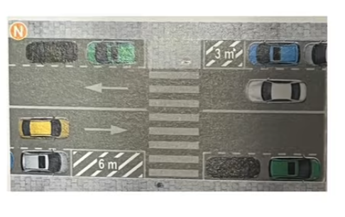

### STOP y línea de detención

- **Si no hay línea:** detenerse **antes de entrar en la intersección** (solo si hay suficiente visibilidad).
- **Si hay línea:** detenerse **sobre la línea** (sin rebasarla).

### Flechas de carril

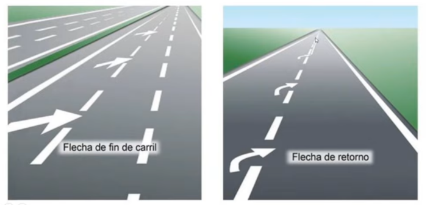

### Líneas amarillas en la calzada

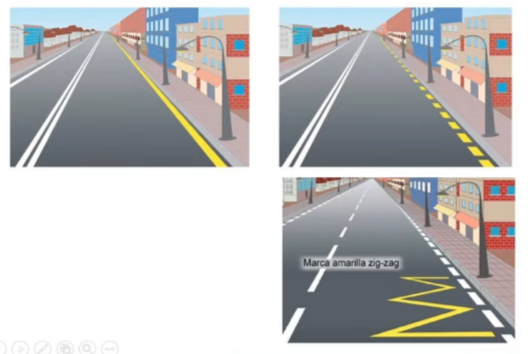

- **Continua:** prohibido **parar y estacionar**.
- **Discontinua:** prohibido **estacionar** (parar sí).

### Marcas reductores de velocidad (2026)

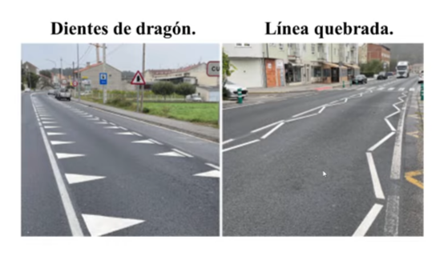

> [!tip] Galones de distancia
> Si ves una marca de galón en la calzada, debes poder ver **otro galón completo** en la vía. Si ves el siguiente → distancia correcta. Si no → estás demasiado cerca.

---

## Luces

> [!info] Finalidad
>
> - **Ver y ser vistos** (conducción pasiva, no activa).
> - **Señalizar** maniobras o presencia (emergencia, avería).

### Tipos de luces y colores

| Luz                        | Posición            | Color                        | Función                                                                                                                                         |
| -------------------------- | ------------------- | ---------------------------- | ----------------------------------------------------------------------------------------------------------------------------------------------- |
| **Posición**               | Delantera y trasera | Blanca delante / roja detrás | Delimitar el vehículo; **obligatorias en poblado** de noche. **Solas NO sirven para circular**.                                                 |
| **Corto alcance (cruce)**  | Delantera           | Blanca                       | Iluminar sin deslumbrar. **Obligatoria de noche** y con condiciones de visibilidad reducida.                                                    |
| **Largo alcance (largas)** | Delantera           | Blanca                       | Iluminar a distancia. **Solo fuera de poblado a más de 40 km/h**. El conductor del vehículo que las lleva debe apagarlas ante el cruce de otro. |
| **Antiniebla delantera**   | Delantera, baja     | Blanca o amarilla            | Con niebla, lluvia intensa, nieve o polvo. **Puede deslumbrar**.                                                                                |
| **Antiniebla trasera**     | Trasera, derecha    | Roja                         | **Solo** en condiciones **especialmente desfavorables** (niebla espesa, lluvia muy intensa, nevada fuerte, humo o polvo densos).                |
| **Galibo**                 | Delantera, alta     | Blanca                       | Vehículos anchos (> 2,10 m). Sustituye a la posición normal en la parte alta.                                                                   |
| **Matrícula**              | Trasera             | Blanca                       | Iluminación permanente de la placa.                                                                                                             |
| **Emergencia**             | Las 4 intermitentes | Tots grocs                   | Vehículo parado o en situación de peligro. **Solo de noche**; con V-16 ya no es necesario salir.                                                |

> [!warning] Antiniebla: cuándo son obligatorias
>
> - **Trasera (obligatoria):** solo en condiciones **especialmente desfavorables** (niebla espesa, lluvia muy intensa, nevada, humo o polvo densos). Art. 106 RGC.
> - **Delantera (opcional):** puede usarse cuando las condiciones meteorológicas o ambientales **disminuyan sensiblemente la visibilidad** (niebla, lluvia, túnel).
> - **Prohibido:** con lluvia ligera o de día despejado.
> - **La trasera puede deslumbrar** a los vehículos de detrás: usar solo en adversas.

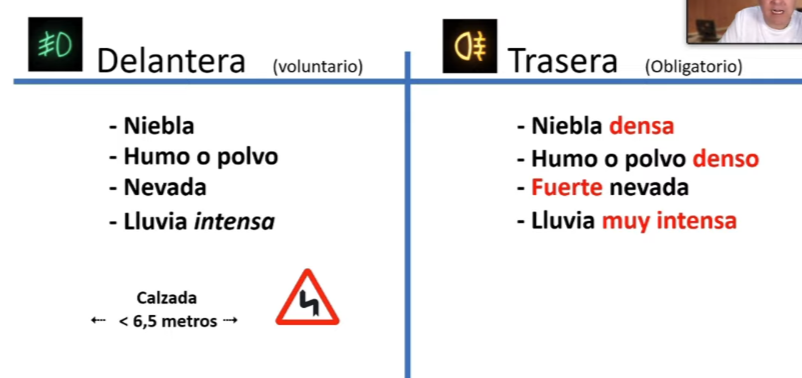

### Avería en la calzada — V-16

> [!danger] V-16 obligatoria desde 1 de enero de 2026
> La **señal luminosa V-16** (dispositivo conectado a la DGT) **sustituye a los triángulos** de preseñalización. Es **obligatoria** desde el **1 de enero de 2026**. Permite señalizar la avería **sin salir del vehículo**, evitando el peligro de caminar por la calzada.
> Fuente: DGT, https://www.dgt.es/muevete-con-seguridad/tecnologia-e-innovacion-en-carretera/Dispositivos-de-presenalizacion-V16/

---

## Cinturón y asientos

> [!info] Art. 117 RGC — regla de oro
> El conductor y **TODOS los ocupantes** están obligados a usar el **cinturón de seguridad** o un **Sistema de Retención Infantil (SRI)** homologado. **Siempre** (urbana e interurbana) y **en todos los trayectos**.

### Asientos y SRI

- **Altura > 135 cm** (o si no hay plaza trasera en deportivos): puede usar el cinturón normal.
- **Altura ≤ 135 cm** o **menor de 12 años**: **SRI obligatorio** (silla o alzador con respaldo, según peso y altura).
- **ISOFIX** o **i-Size** (ECE R129): sistemas de anclaje al chasis que garantizan la correcta instalación del SRI.

> [!warning] Excepciones — cuándo NO es obligatorio el cinturón en poblado
>
> - **Repartidor de mercancías** en trayectos cortos de carga y descarga.
> - **Conductores de pasajeros en servicio de urgencia** (ambulancia, transporte sanitario).
> - **Taxistas** y **alumnos de autoescuela** (solo cuando están dando clase).
> - **Persona con certificado médico** que lo justifique.
> - **Marcha atrás** para aparcar o salir.
> - **Embarazadas** con certificado médico que lo desaconseje.
> - **Motocicletas y ciclomotores** (no llevan cinturón; usan casco).
>
> **Fuente:** art. 117 RGC.

### Bicis y casco

- **Fuera de poblado:** **casco siempre obligatorio** (todas las edades).
- **Dentro de poblado:** **casco obligatorio solo para menores de 16 años**.

### Niños en moto

- **Menores de 7 años:** **prohibido** ir en moto.
- **Entre 7 y 12 años:** permitido **solo con tutor legal** y autorización expresa.
- **A partir de 12 años:** pueden ir como pasajeros sin condiciones especiales.

> [!success] Asiento del conductor
> El conductor debe ir **siempre sentado correctamente**, con el asiento regulado para acceder a los pedales con la pierna ligeramente flexionada. La posición debe permitir ver bien la calzada y los retrovisores.

### Carga y dimensiones

> [!info] Principios generales
>
> - La carga **no puede comprometer la estabilidad** del vehículo.
> - La carga **no puede sobresalir lateralmente** de la carrocería.
> - La carga **suelta es peligrosa** salvo que esté en el **maletero** o sujeta con dispositivos homologados.
> - **Prohibido** dejar carga en la **acera**.

#### Dimensiones máximas

| Vehículo            | Longitud | Anchura | Altura |
| ------------------- | -------- | ------- | ------ |
| **Turismo**         | 12 m     | 2,55 m  | 4 m    |
| **Camión / furgón** | 12 m     | 2,55 m  | 4 m    |
| **Articulado**      | 16,5 m   | 2,55 m  | 4 m    |

> [!danger] Anchura máxima con carga
> La carga **nunca** debe superar la anchura del vehículo. Si sobresale, vehículo y carga **suman** un máximo de **2,55 m** total.

#### Carga que sobresale por detrás

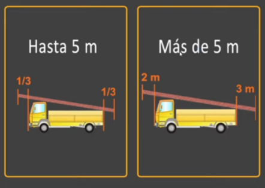

**Por la parte trasera (art. 15 RGC):**

| Vehículo            | Carga divisible       | Carga indivisible  |
| ------------------- | --------------------- | ------------------ |
| **Turismo**         | 10% de su longitud    | 15% de su longitud |
| **Camión / furgón** | sí (pequeña cantidad) | sí                 |

**Por la parte delantera:** solo **camiones y furgones**, y solo una pequeña cantidad (regla nemotécnica: «un poco por delante y por detrás»).

> [!warning] Trampa de longitud total
> Si la carga **trasera + vehículo** superan los **12 m totales**, hay que **recortar** la carga hasta que la suma no exceda el límite.

#### Señalización de carga sobresaliente (V-20)

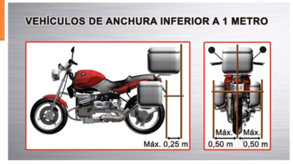

> [!danger] V-20 obligatoria
> Si la carga sobresale por detrás del vehículo, **debe señalizarse** con un panel de franjas rojas y blancas (V-20).
>
> - De **día:** solo el panel V-20.
> - De **noche:** V-20 + **luz roja** (trasera, visible por detrás).
>
> La **L** (señal de carga larga) va detrás a la **izquierda**.

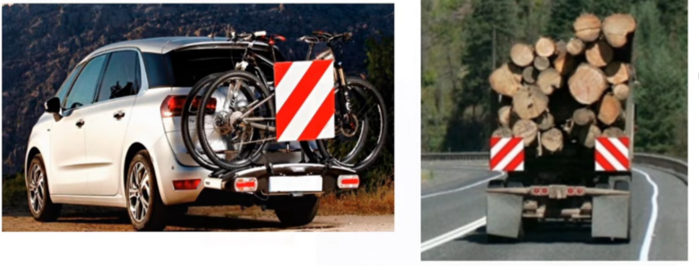

#### Vehículos de anchura < 1 m (motos y similares)

| Tipo                          | Por detrás | Desde el eje |
| ----------------------------- | ---------- | ------------ |
| **Moto / ciclo / ciclomotor** | 0,25 m     | 0,5 m        |

> [!tip] Otras señales V (vehículos)
>
> | Señal    | Significado                                                                                |
> | -------- | ------------------------------------------------------------------------------------------ |
> | **V-1**  | Vehículo lento (≤ 40 km/h)                                                                 |
> | **V-2**  | Vehículo de grandes dimensiones                                                            |
> | **V-3**  | Vehículo prioritario (con luces azules + sirena)                                           |
> | **V-5**  | Vehículo de emergencia en servicio                                                         |
> | **V-7**  | Vehículo con **carga peligrosa** (señal específica de transporte de mercancías peligrosas) |
> | **V-8**  | Vehículo de transporte escolar                                                             |
> | **V-16** | Dispositivo luminoso de preseñalización de avería (sustituye a triángulos desde 1/1/2026)  |
> | **V-20** | Carga sobresaliente (panel de franjas rojas y blancas)                                     |

---

## ITV (Inspección Técnica de Vehículos)

> [!info] Periodicidad general
>
> - **Turismos y motos:** primera a los **4 años**, luego a los **6, 8, 10** años. A partir de los 10, **cada 2 años**.
> - **Camiones:** primera a los **2 años**, luego anual.
> - **Motocicletas:** cada **2 años** a partir del 4.º año.
> - **Históricos (> 60 años):** exentos (desde octubre 2024).

### Resultado de la ITV

- **Favorable:** el vehículo pasa la inspección.
- **Desfavorable:** **15 días** para arreglar los defectos por **medios propios**.
  - Si tras la reparación vuelve a ser **desfavorable** (o no se presenta): **grúa** y traslado al taller.
- **Negativa:** el vehículo no puede circular hasta superar la inspección.

> [!tip] Parabrisas
> La **inspección ITV** revisa el parabrisas (estado, grietas, lámina adhesiva). Solo se permiten **láminas en ventanillas posteriores** y solo si el vehículo tiene 2 retrovisores exteriores (art. 19 RGC).

### Documentación ITV

- **Tarjeta ITV** (informe de inspección): la entrega el centro ITV tras cada inspección. Es **obligatoria** en todos los vehículos a motor que deban pasar la ITV.

---

## Documentación

### Documentos del vehículo

| Documento                         | Obligatorio                                 | Notas                                                                                                |
| --------------------------------- | ------------------------------------------- | ---------------------------------------------------------------------------------------------------- |
| **Permiso de circulación**        | Sí (todos)                                  | Excepto: ciclos, vehículos de tracción animal y algunos VMP.                                         |
| **Tarjeta ITV**                   | Sí (vehículos a motor con ITV)              | Aportada por el centro ITV tras cada inspección.                                                     |
| **Seguro obligatorio a terceros** | Sí (vehículos a motor + remolques > 750 kg) | NO obligatorio: vehículos sin motor, ciclos, carros, VMP, remolques ≤ 750 kg sin sistema de frenada. |

### Accidentes: ¿a quién cubre el seguro?

- **Daños del vehículo propio:** corre por cuenta del tomador (seguro a todo riesgo, si lo tiene).
- **Daños corporales del conductor propio:** seguro a ocupantes (no obligatorio, opcional).
- **Daños a terceros (resto):** seguro obligatorio a terceros (lo cubre el seguro del causante).
- **Acompañantes del vehículo culpable:** cubiertos por el seguro del vehículo culpable (responsabilidad civil).

> [!tip] Parte amistoso
> Si el accidente es **leve y sin heridos**, se puede rellenar el **parte amistoso** (DAA — Declaración Amistosa de Accidente). Cada parte se queda con una copia y se presenta al seguro en **7 días hábiles**.

### Documentos del conductor

- **Permiso de conducir (carnet):** debe renovarse (la parte médica varía según edad).
- **App miDGT:** app oficial con el carnet de conducir digital, vehículos asociados, puntos y notificaciones.

### Permisos de conducción (categorías)

> [!info] Resumen
> Hay **9 categorías principales** de permisos + la **licencia AM**. Cada una autoriza un tipo de vehículo y requiere una edad mínima.

| Permiso             | Edad mínima                                   | Vehículos autorizados                                                                      | Observaciones                                                                                                            |
| ------------------- | --------------------------------------------- | ------------------------------------------------------------------------------------------ | ------------------------------------------------------------------------------------------------------------------------ |
| **AM**              | 15 años                                       | Ciclomotores de 2 o 3 ruedas, cuadriciclos ligeros y VMP.                                  | Velocidad máx. 45 km/h.                                                                                                  |
| **A1**              | 16 años                                       | Motos de hasta 125 cc, potencia ≤ 11 kW, rel. peso/potencia ≤ 0,1 kW/kg.                   | Triciclos hasta 15 kW.                                                                                                   |
| **A2**              | 18 años                                       | Motos de **cualquier cilindrada** con potencia ≤ 35 kW y rel. peso/potencia ≤ 0,2 kW/kg.   | No se puede limitar un A para sacar A2.                                                                                  |
| **A**               | 20 años (con 2 años de A2) o 24 años (sin A2) | Motos de **cualquier cilindrada y potencia**, triciclos > 15 kW.                           | A partir de los 20 años, habiendo sido titular del A2 durante 2 años.                                                    |
| **B**               | 18 años                                       | Turismos y furgones hasta **3.500 kg MMA**, hasta **9 plazas** (incluido el conductor).    | Remolque ligero: ≤ 750 kg, o > 750 kg si MMA total ≤ 3.500 kg (B + B96) o hasta 4.250 kg con E si se cumplen requisitos. |
| **B + E** (E con B) | 18 años                                       | Conjunto de vehículos: turismo + remolque > 750 kg, MMA total > 3.500 kg (hasta 7.000 kg). | Necesita B previo + curso o examen práctico.                                                                             |
| **C1**              | 18 años                                       | Camiones entre **3.500 y 7.500 kg MMA**.                                                   |                                                                                                                          |
| **C**               | 21 años                                       | Camiones de **más de 7.500 kg MMA**.                                                       | Antes 21, ahora 18 con C1 + curso.                                                                                       |
| **D1**              | 21 años                                       | Autobuses de **hasta 16 plazas** (incluido conductor), longitud ≤ 8 m.                     |                                                                                                                          |
| **D**               | 24 años                                       | Autobuses de **más de 16 plazas**.                                                         | Desde 21 con D1 + curso.                                                                                                 |

> [!bug] Tractores agrícolas con B
>
> - **Tractor agrícola** (con o sin remolque): se puede conducir con el **B** si la **MMA no supera 3.500 kg** y la velocidad máxima es **≤ 40 km/h**.
> - Si el tractor supera estos límites → requiere **permiso específico** de tractor agrícola.

### Permiso por puntos (LSCV)

> [!info] Reglas generales
>
> - **Saldo inicial:** **12 puntos** (no 8).
> - **Recuperación automática:** tras **2 años sin infracciones firmes** se recuperan los 12 puntos. Si la pérdida fue por infracciones **muy graves**, el plazo es de **3 años**.
> - **Pérdida total (0 puntos):** retirada del carnet durante **6 meses** (3 meses para profesionales). Tras este plazo, se obtiene un nuevo saldo de **8 puntos**.
> - **Curso de sensibilización y reeducación vial:** recupera **hasta 4 puntos**. Se puede hacer **1 vez al año**.

#### Evolución del saldo de puntos

| Situación                                                    | Saldo resultante                              |
| ------------------------------------------------------------ | --------------------------------------------- |
| Inicio (sacar el carnet)                                     | **12 puntos**                                 |
| 2 años sin infracciones firmes                               | **12 puntos** (recuperación total automática) |
| 3 años más sin infracciones                                  | **14 puntos** (límite legal)                  |
| Curso de sensibilización (1 vez al año)                      | **+4 puntos** (máx. 12)                       |
| Pérdida total (0 puntos) → 6 meses sin carnet → recuperación | **8 puntos** (de nuevo)                       |

## Accidentes

> [!info] Factores del accidente (en orden de importancia)
>
> 1. **Factor humano** (conductor, peatón, ciclista) → principal causa.
> 2. **Factor de la vía** (estado, trazado, señalización).
> 3. **Factor del vehículo** (estado mecánico, mantenimiento).
>
> **El accidente es evitable y prevenible.**

### Dónde se producen más incidentes

- **Menos accidentes en curva** que en recta (en recta el conductor se duerme).
- **Menos víctimas graves** en proporción a medida que **baja la velocidad** del vehículo.
- **Más peligroso en carretera convencional** que en autovía (cinturón, Airbag, ABS en coches modernos).
- **Más accidentes en festivos**, **horas punta** y **fines de semana**.

### Grupos de riesgo

- **Jóvenes** (15-29 años) — mayor tasa de siniestralidad.
- **Conductores mayores** — mayor vulnerabilidad física.
- **Motocicletas, ciclos y bicicletas** — mayor exposición.
- **Peatones** — especialmente niños y mayores.

### Distancias de reacción, frenado y detención

> [!info] Definiciones
>
> - **Distancia de reacción:** espacio recorrido desde que ves el peligro hasta que pisas el freno. Depende del **tiempo de reacción** (~1 segundo) y de la velocidad.
> - **Distancia de frenado:** espacio recorrido desde que pisas el freno hasta que el vehículo se detiene. Crece con el **cuadrado de la velocidad**.
> - **Distancia de detención:** reacción + frenado = espacio total recorrido desde el peligro hasta detenerse.

#### Tabla según velocidad (aproximada)

| Velocidad | Reacción (1s) | Frenado | Detención total |
| --------- | ------------- | ------- | --------------- |
| 50 km/h   | 14 m          | 10 m    | 24 m            |
| 90 km/h   | 25 m          | 34 m    | 59 m            |
| 100 km/h  | 28 m          | 42 m    | 70 m            |
| 120 km/h  | 33 m          | 60 m    | 93 m            |
| 130 km/h  | 36 m          | 71 m    | 107 m           |

> [!tip] Regla de los galones (recordatorio)
> En la calzada debes poder ver **otro galón entero** entre tú y el vehículo de delante. Si no lo ves → estás demasiado cerca.

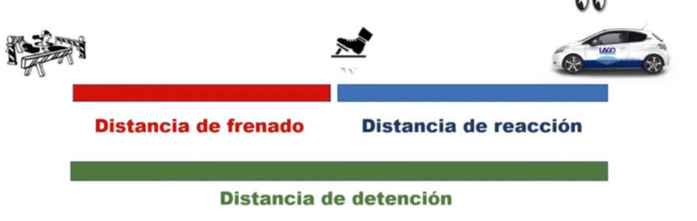

### Fatigue y paradas

> [!warning] Parada cada 2 horas o 200 km
> Haz una **parada cada 2 horas o 200 km** para evitar la fatiga. La fatiga es responsable de un porcentaje significativo de accidentes mortales en vías interurbanas.

### Teléfono móvil

> [!danger] Uso del móvil
>
> - **Prohibido** utilizar el teléfono móvil durante la conducción.
> - **Permitido** con **manos libres** (Bluetooth, auriculares), siempre que el conductor no tenga que retirar la atención de la conducción.
> - **Sanción:** 200 € + **6 puntos**.
> - La regla de «1 minuto» o «menos de 1 minuto» es un referente de la prueba, no una norma del RGC.
>
> **Art. 76 LSCV.**

### Alcohol i drogues

> [!info] Mites falsos
>
> - **Cap remei** (cafè, aigua, exercici, dutxa freda) **NO accelera** l'eliminació de l'alcohol. El metabolisme és constant (~0,10-0,15 g/l per hora).
> - La **rapidesa** amb què es consumeix NO canvia la taxa màxima; sí que afecta la taxa instantània.
> - La taxa depèn de **quantitat, tipus de beguda, pes, gènere, menjar previ** i metabolisme individual.

#### Taxa màxima d'alcohol en aire expirat (art. 20-23 RGC)

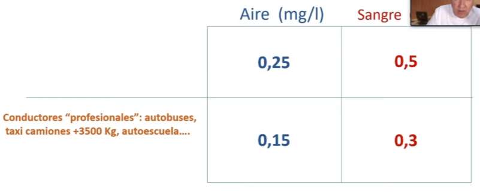

| Conductor                                  | Aire expirat  | Sang equivalent |
| ------------------------------------------ | ------------- | --------------- |
| **General**                                | **0,25 mg/l** | 0,5 g/l         |
| **Novel** (2 años desde el primer permiso) | **0,15 mg/l** | 0,3 g/l         |
| **Professional**                           | **0,15 mg/l** | 0,3 g/l         |
| **Menor de edad**                          | **0,0 mg/l**  | 0,0 g/l         |

> [!bug] El "novel" cuenta desde el PRIMER permiso
> El plazo de 2 años de **novel** empieza desde el **primer permiso** que habilita para conducir vehículos a motor. Si tienes B desde 2025 y obtienes A2 en 2026, el plazo **NO se reinicia** — cuenta desde el B. Implicación: las tasas reducidas (0,3 g/l) **ya NO aplican** con el A2 si el B tiene más de 2 años.

> [!warning] Drogas (art. 27 RGC)
>
> - **Prohibido** circular con **presencia de drogas** en el organismo (THC, cocaína, anfetaminas, etc.).
> - El THC puede tardar **días o semanas** en eliminarse del todo, pero el reglamento prohíbe la presencia, no la intoxicación.
> - **Sanción:** 1.000 € + **6 puntos** (inf. muy grave).

### Obligación de auxilio (art. 129 RGC)

> [!success] ¿Quién está obligado a auxiliar?
>
> - Todos los **conductores** implicados en un accidente.
> - Todos los **peatones y ciclistas** **implicados** en el accidente.
> - **NO** todos los usuarios de la vía (un peatón que no ha estado implicado no está obligado).
>
> La obligación incluye: **detenerse, señalizar, auxiliar a los heridos** y, si es necesario, **avisar a los servicios de emergencias (112)**.

---

## Seguridad

> [!info] Dispositivos de seguridad
>
> - **Activa:** evitan el accidente (frenos, luces, neumáticos, suspensión, ADAS).
> - **Pasiva:** minimizan los daños una vez el accidente ha ocurrido (cinturón, Airbag, SRI, reposacabezas, estructura del chasis, parabrisas laminado).

### Neumáticos

- **Dibujo mínimo:** **1,6 mm** (recomendado ≥ 2-3 mm).
- **Presión:** según el **fabricante del vehículo** (nunca inventar).
- **Vida útil:** cambiarlos **cada 5 años** aproximadamente, o antes si el dibujo se ha gastado.
- **Cambio de una rueda:**
  1. Aflojar las tuercas (sin sacarlas).
  2. Levantar el vehículo con el gato.
  3. Sacar las tuercas y la rueda.
  4. Poner la rueda de recambio.
  5. **Apretar las tuercas en diagonal** (no en círculo).
  6. Bajar el vehículo y terminar de apretar.

### Suspensión

- La suspensión **mantiene las ruedas en contacto con el suelo**, garantizando la adherencia y la estabilidad.
- Si falla, el vehículo pierde capacidad de frenada y dirección.

### Luces y otros activos

Las **luces** (posición, corto, largo, antiniebla) y los **neumáticos** son **dispositivos de seguridad activa**: evitan el accidente.

### Seguridad pasiva

| Componente                         | Función                                                                                                                                                                                      |
| ---------------------------------- | -------------------------------------------------------------------------------------------------------------------------------------------------------------------------------------------- |
| **Chasis**                         | Estructura que absorbe la energía del impacto deformándose.                                                                                                                                  |
| **Parabrisas laminado**            | Tiene una **lámina de plástico** entre dos vidrios que **evita que los fragmentos salgan** proyectados. El vidrio **templado** (vidrios laterales) se rompe en trozos pequeños no cortantes. |
| **Cinturón + Airbag**              | Retienen al ocupante y evitan que golpee el interior.                                                                                                                                        |
| **SRI (ISOFIX / i-Size)**          | Anclado al **chasis** (no al asiento), garantiza la sujeción correcta.                                                                                                                       |
| **Reposacabezas**                  | Evita el **esguince cervical** en colisiones por detrás.                                                                                                                                     |
| **Pretensores pirotécnicos**       | Tensen el cinturón en caso de impacto.                                                                                                                                                       |
| **Zona de deformación programada** | Zonas del chasis diseñadas para deformarse y absorber la energía.                                                                                                                            |

### Seguridad preventiva (antes de circular)

- **Limpiar el parabrisas** (visibilidad).
- **Luneta térmica** funcional (desescarchar la parte posterior).
- **Ergonomía del volante y asiento** (posición correcta).
- **Espejos y ángulos muertos** revisados.
- **Triaje del vehículo**: frenos, luces, neumáticos, nivel de aceite y líquido de frenos.

### Sistemas ADAS (ayudas a la conducción)

> [!info] ¿Qué son?
> Sistemas electrónicos de ayuda a la conducción que **se pueden desactivar** por el conductor. Son **obligatorios** progresivamente en los vehículos nuevos de la UE según el Reglamento (UE) 2019/2144 (General Safety Regulation), aplicable entre 2022 y 2026.

#### Tabla resumen de los principales sistemas

| Sistema                         | Significado                                | Función                                                                                                                    |
| ------------------------------- | ------------------------------------------ | -------------------------------------------------------------------------------------------------------------------------- |
| **TPMS**                        | Tyre Pressure Monitoring System            | Control de **presión de los neumáticos** (obligatorio desde 2014).                                                         |
| **AEB**                         | Autonomous Emergency Braking               | **Frenada de emergencia autónoma** (frena solo si hay obstáculo).                                                          |
| **LDW**                         | Lane Departure Warning                     | **Avisa** si sales del carril (no corrige).                                                                                |
| **LKA / LK**                    | Lane Keeping Assist                        | **Corrige** la trayectoria para mantenerte en el carril.                                                                   |
| **BSIS / BSM**                  | Blind Spot Information / Monitoring System | **Avisa** de vehículo en el ángulo muerto (cicles para camiones, turismos para turismos).                                  |
| **REV**                         | Reversing Camera                           | **Cámara de marcha atrás** (muestra imagen, no pita).                                                                      |
| **RTCA**                        | Rear Cross Traffic Alert                   | **Avisa y frena** si viene un vehículo por detrás cuando marchas atrás (≤ 15 km/h).                                        |
| **DDR**                         | Driver Drowsiness Recognition              | **Detecta fatiga** con cámaras (ojos, cara).                                                                               |
| **ADR**                         | Attention / Distraction Recognition        | **Detecta distracciones** del conductor.                                                                                   |
| **ISA**                         | Intelligent Speed Adaptation               | **Avisa o frena** si superas el límite de velocidad.                                                                       |
| **DDA**                         | Alcohol Interlock                          | Dispositivo de alcohol en aire; el vehículo no arranca si das positivo (para reincidentes).                                |
| **SLI** (ISA)                   | Speed Limit Information                    | **Avisa** del límite de velocidad (lee las señales de la vía y las muestra en el velocímetro).                             |
| **TSR**                         | Traffic Sign Recognition                   | **Lee las señales de tráfico** y las muestra en el salpicadero (límite de velocidad, prohibido adelantar, etc.).           |
| **eCall**                       | Emergency Call                             | **Llama automáticamente al 112** en caso de accidente grave. Obligatorio en la UE para modelos nuevos desde **31/3/2018**. |
| **EDR**                         | Event Data Recorder                        | **"Caja negra"** del vehículo: registra velocidad, frenada, ángulo de giro, etc. en los segundos previos al impacto.       |
| **EBD**                         | Electronic Brakeforce Distribution         | **Distribuye electrónicamente la fuerza de frenada** entre las ruedas (complementa el ABS).                                |
| **HSA / Hill Holder**           | Hill Start Assist                          | Asistente de arranque en pendiente: **evita que el coche ruede hacia atrás** al reanudar la marcha en cuesta.              |
| **Start & Stop**                | Sistema de parada y arranque               | **Apaga el motor** en semáforos/atasques y lo **arranca** al pisar el embrague. Reduce consumo y emisiones.                |
| **Cámara visión trasera (REV)** | Reversing Camera                           | Muestra imagen en pantalla al engranar la marcha atrás.                                                                    |
| **Cámara 360º**                 | Top-down / surround view                   | Muestra una **vista cenital** del vehículo y su entorno (parking).                                                         |
| **ADAS aftermarket**            | ADAS post-venta                            | **Se pueden instalar** cualquier ADAS que no afecte a los sistemas de seguridad del vehículo.                              |

> [!tip] Mnemotécnica ADAS
>
> - **TPMS = "Tu Presión"** (porque la P es de presión y TP = "tu presión" en recordatorio).
> - **Siempre que aparece una B → es de frenos (Brake):** AEB, RTCA, BSM...
> - **Siempre que aparece una L → es de líneas de carril:** LDW (avisa), LK (corrige).
> - **REV = cámara** (NO pita, muestra imagen).
> - **Si lleva I → es "inteligente"** (SLI, ISA, ACC, AEB).
> - **DDR = "De Dormir, avisa"** (Driver Drowsiness Recognition).
>
> **ABS vibrando el freno:** es **normal**, no indica avería. Es el sistema antibloqueo trabajando.

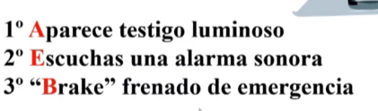

> [!success] ADAS en motos
> Las motos **llevan algunos sistemas ADAS desde hace años**:
>
> - **ABS:** obligatorio desde **2017** para motos de **125 cc y superiores** (Reglamento UE 168/2013). Para motos más pequeñas (≤ 125 cc), obligatorio desde 2016.
> - **Control de tracción (TC):** muy extendido en motos modernas, evita que la rueda derrape al acelerar.
> - **Control de crucero adaptativo (ACC):** emergente, permite mantener distancia con el vehículo de delante.
> - **AEB en motos:** todavía **en fase de implementación** (la UE prevé su obligatoriedad progresiva, pero **no es obligatorio** en el examen actual de carnet A2).
> - **Monitor de presión de neumáticos (TPMS):** ya obligatorio en motos nuevas.
>
> En resumen: en el examen del carnet B **no preguntará** por ADAS específicos de moto, pero en la práctica **mucha tecnología ya es obligatoria o muy común**.

## Factor Vía

> [!info] Factores externos que afectan a la conducción
> Además del factor humano, la **vía** y las **condiciones externas** son claves para la siniestralidad.

### Curvas

- **Frenar ANTES de entrar** en la curva, no dentro.
- Reducir la marcha antes de girar.
- No acelerar hasta que el coche esté enderezado.

### Condiciones adversas

> [!warning] El sol también es adversidad
> Las condiciones adversas **incluyen el sol** (deslumbramiento), no solo lluvia o niebla. El deslumbramiento reduce drásticamente la visibilidad.

- **Lluvia:** reduce la adherencia (aquaplaning).
- **Niebla:** reduce la visibilidad **y** la adherencia.
- **Nieve/hielo:** adherencia mínima; cadenas obligatorias en muchas zonas.
- **Viento:** efecto pantalla de camiones al adelantarles (ráfagas laterales).

### Aquaplaning

> [!danger] Aquaplaning: cómo actuar
>
> - **NO frenar** bruscamente (el coche está flotando sobre el agua).
> - **Soltar el acelerador** progresivamente.
> - **Mantener la dirección** recta.
> - Esperar a que los neumáticos vuelvan a tener contacto con el asfalto.

### Cadenas

- Se colocan **en las ruedas motrices**.
- En 4x4: consultar manual (a veces solo delante, a veces en las 4).
- En coches sin tracción: **en las ruedas traseras** (las que transmiten fuerza al eje).

---

## Actuación en accidente (protocolo PAS)

> [!info] Orden de prioridad: P → A → S
>
> 1. **PROTEGER** (a ti mismo y a la zona).
> 2. **AVISAR** (a los servicios de emergencia, 112).
> 3. **SOCORRER** (a los heridos).

### ¿Quién está obligado a ayudar?

> [!success] Obligación de auxilio (art. 129 RGC)
>
> - **Conductores y usuarios IMPLICADOS** en el accidente: **obligados**.
> - **Testigos NO implicados:** si ya están presentes agentes o los heridos están siendo socorridos, **no es obligatorio parar**.
> - El objetivo es **no causar más daño** y **auxiliar** sin entorpecer.

### Reglas de protección

- **Proteger primero a ti mismo** (no actúes si te pones en riesgo).
- **Después proteger la vía** (señales, V-16, triángulos — ya sustituidos por V-16 desde 2026).
- **Avisar al 112**: localización, número de heridos, estado.
- **Socorrer a los heridos** (si estás formado) sin causar más daño.

### Primeros auxilios básicos

> [!warning] Prioridad en la atención a heridos
>
> 1. **Inconsciente** (comprobar respiración).
> 2. **Persona que se desangra** (hemorragia grave).
> 3. Resto de heridos por gravedad.

- **Torniquete:** si se aplica, **apuntar la hora** (los servicios médicos lo necesitan).
- **Posición de shock:** acostar al herido con las **piernas elevadas**; suele estar **pálido/blanco**, sudoroso, pulso débil.
- **Quemaduras:** **NUNCA quitar la ropa** que esté pegada a la quemadura (puede empeorar el daño).
- **Hablar con los heridos:** mantener la calma, **solo palabras tranquilizadoras** si no tienes formación; no moverlos salvo peligro inmediato.

---

## Mecánica básica

### Diagnóstico por el humo del escape

| Color del humo           | Causa probable                                         | Solución                                                     |
| ------------------------ | ------------------------------------------------------ | ------------------------------------------------------------ |
| **Negro** (mucho)        | Mezcla rica en combustible / filtro saturado           | Revisar filtro de aire, inyectores.                          |
| **Azul**                 | Se quema **aceite** (motor gastado, juntas, segmentos) | Revisar nivel de aceite; ir al taller.                       |
| **Blanco (persistente)** | Se quema **agua** (refrigerante entra en cámara)       | NO confundir con vapor de invierno; revisar junta de culata. |

### Componentes del escape

- **Catalizador:** es el "filtro" de gases. Se cambia **muy de vez en cuando** (vida útil larga).
- **Silenciador:** no necesita cambio si no se rompe (no es un "filtro").

### Comprobar el nivel de aceite

> [!tip] Procedimiento correcto
>
> 1. Coche **en llano** y con el **motor frío** (o esperar 5-10 min tras parar).
> 2. Sacar la **varilla** de aceite.
> 3. **Limpiarla** con un trapo.
> 4. **Volver a meterla** y sacarla de nuevo.
> 5. Comprobar que el nivel está **entre las marcas MIN y MAX**.

### Reglaje de luces

Las luces tienen **reglaje** (altura y orientación) que se puede **ajustar manualmente** desde el salpicadero o el motor. Es importante para no deslumbrar a otros conductores.

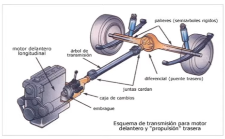

### Accesorios obligatorios en el vehículo

| Accesorio                                 | ¿Obligatorio?                 | Notas                                                     |
| ----------------------------------------- | ----------------------------- | --------------------------------------------------------- |
| **Chaleco reflectante**                   | Sí                            | Al alcance del conductor (no en el maletero).             |
| **Luz V-16**                              | Sí (desde 1/1/2026)           | Sustituye a los triángulos de preseñalización.            |
| **Rueda de repuesto o kit antipinchazos** | Sí                            | Depende del vehículo; algunos ya no la llevan de fábrica. |
| **Extintor**                              | Vehículos pesados y autobuses | Para turismos: recomendado pero no obligatorio.           |
| **Triángulos**                            | NO obligatorio desde 2026     | V-16 los ha sustituido.                                   |

---

## Técnicas de conducción

### Conducción preventiva

> [!info] Pilares de la conducción preventiva
>
> 1. **Visión:** mirar a lo lejos, a los lados, usar espejos y **girar la cabeza** (los espejos tienen ángulo muerto).
> 2. **Anticipación:** prever lo que va a pasar (semáforo, peatón, vehículo lento).
> 3. **Gestión del espacio:** mantener distancias y márgenes de seguridad.

> [!warning] Indicar no da derecho a hacer nada
> Poner el intermitente **no te da prioridad**. Solo **anuncia tu intención**. Debes esperar a que la vía esté libre y respetar las normas.

### Cambios de marcha recomendados

| Tipo de motor | Rango óptimo de revoluciones |
| ------------- | ---------------------------- |
| **Diésel**    | **1.300 - 2.000 rpm**        |
| **Gasolina**  | **2.000 - 2.500 rpm**        |

.png>)

> [!tip] Baca del coche
> La baca (portaequipajes superior) **aumenta el consumo** por el peso y la resistencia aerodinámica. **Quítala si no la usas** para ahorrar combustible.

---

## Etiquetas ambientales (DGT)

> [!info] ¿Para qué sirven?
> Clasifican los vehículos según su **impacto ambiental** (emisiones). Algunas ciudades (Madrid, Barcelona) las usan para restringir el acceso en episodios de alta contaminación.

### Tipos de etiqueta

| Etiqueta         | Color      | Vehículos                                                                                             |
| ---------------- | ---------- | ----------------------------------------------------------------------------------------------------- |
| **0 Emisiones**  | Azul       | Eléctricos puros, **hidrógeno**, híbridos con > 40 km de autonomía eléctrica.                         |
| **ECO**          | Verde/azul | Híbridos, GNC, GLP, **autonomía < 40 km en eléctrico**.                                               |
| **C**            | Verde      | **Gasolina** a partir de **2006** (Euro 4+) · **Diésel** a partir de **2014** (Euro 6).               |
| **B**            | Amarilla   | **Gasolina** a partir de **2000** (Euro 3) · **Diésel** a partir de **2006** (Euro 4+).               |
| **Sin etiqueta** | —          | Vehículos anteriores al 2000, o que no cumplen los mínimos. **No son considerados medioambientales**. |

### Vehículos históricos

- **Mínimo 20 años** de antigüedad + reconocimiento como **vehículo histórico** (IAPHMT).
- **No llevan etiqueta ambiental** salvo que voluntariamente la soliciten.
- Tienen **exenciones** de algunas restricciones (limitaciones ZBE, etc., según municipio).

> [!tip] Mnemotécnica
>
> - **0 emisiones:** eléctrico + hidrógeno.
> - **ECO:** autonomía eléctrica **menor de 40 km** o gas natural/GLP.
> - **C (verde):** los **más nuevos** que cumplen Euro 4+ (gasolina 2006) o Euro 6 (diésel 2014).
> - **B (amarilla):** anteriores a la C, todavía aceptables.
> - **Sin etiqueta:** anteriores al 2000, contaminantes.
